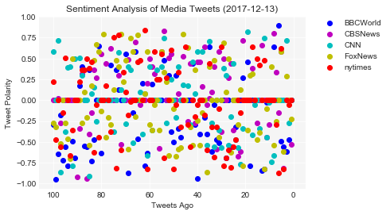
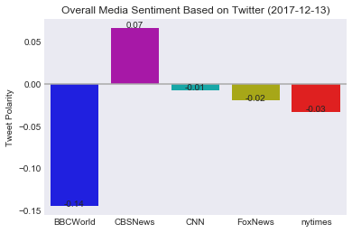

# Homework 7 - NEWS MOOD


```python
#Dependencies
import json
import pandas as pd
import matplotlib.pyplot as plt
import tweepy
import seaborn as sns
import numpy as np
import datetime

from vaderSentiment.vaderSentiment import SentimentIntensityAnalyzer
analyzer = SentimentIntensityAnalyzer()
```


```python
#The apikeys module wasn't able to be installed for some reason. 
#I tried 'pip install apikeys' in my basic command prompt console within my PythonData environment but came across error:
    #Could not find a version that satisifes the requirement apikeys (from versions: ) No matching distribution found for apikeys
#So I tried another module called 'config' that I found from this website: http://www.blacktechdiva.com/hide-api-keys/
import config
```

## Gathering Twitter Data


```python
# Twitter API Keys
consumer_key = config.api_key
consumer_secret = config.api_secret
access_token = config.access_token
access_token_secret = config.token_secret

# Setup Tweepy API Authentication
auth = tweepy.OAuthHandler(consumer_key, consumer_secret)
auth.set_access_token(access_token, access_token_secret)
api = tweepy.API(auth, parser=tweepy.parsers.JSONParser())
```


    ---------------------------------------------------------------------------

    AttributeError                            Traceback (most recent call last)

    <ipython-input-12-1f966d62d7a2> in <module>()
          1 # Twitter API Keys
          2 consumer_key = config.api_key
    ----> 3 consumer_secret = config.api_secret
          4 access_token = config.access_token
          5 access_token_secret = config.token_secret
    

    AttributeError: module 'config' has no attribute 'api_secret'


```python
target_users = ['BBCWorld', 'CBSNews','CNN','FoxNews','nytimes']

# Create an empty list to hold sentiments.
screen_name = []
tweet_text = []
timestamp = []
tweet_number = []
compound_scores = []
pos_scores = []
neg_scores = []
neut_scores = []


for target_user in target_users:

    tweet_counter = 0
    
    # Grab 25 tweets
    public_tweets = api.user_timeline(target_user, count=100, result_type="recent")

    # Loop through all tweets
    for tweet in public_tweets:
        #I didn't add code to filter out twitter bots since I'm pulling tweets using official twitter accounts of media outlets
        # Get text of tweet
        text = tweet['text']
        screen_name.append(tweet["user"]["screen_name"])
        timestamp.append(tweet["created_at"])
        
        # Run Vader Analysis on each tweet
        scores = analyzer.polarity_scores(text)
        compound = scores['compound']
        pos = scores['pos']
        neut = scores['neu']
        neg = scores['neg']

        # Append sentiment data
        compound_scores.append(compound)
        pos_scores.append(pos)
        neut_scores.append(neut)
        neg_scores.append(neg)
        
        #Append Tweet data
        tweet_text.append(text)
        
        #Increment tweet_number
        tweet_counter = tweet_counter+1
        tweet_number.append(tweet_counter)
```


```python
summary_df = pd.DataFrame({'screen_name': screen_name,'tweet_number': tweet_number,
                           'timestamp': timestamp, 'compound': compound_scores, 'pos': pos_scores,
                           'neut': neut_scores, 'neg':neg_scores, 'tweet_text':tweet_text})
#Reorder columns
summary_df = summary_df[['screen_name','tweet_number', 'timestamp','compound','neg','neut','pos','tweet_text']]
summary_df.head()
```


<div>
<style>
    .dataframe thead tr:only-child th {
        text-align: right;
    }

    .dataframe thead th {
        text-align: left;
    }

    .dataframe tbody tr th {
        vertical-align: top;
    }
</style>
<table border="1" class="dataframe">
  <thead>
    <tr style="text-align: right;">
      <th></th>
      <th>screen_name</th>
      <th>tweet_number</th>
      <th>timestamp</th>
      <th>compound</th>
      <th>neg</th>
      <th>neut</th>
      <th>pos</th>
      <th>tweet_text</th>
    </tr>
  </thead>
  <tbody>
    <tr>
      <th>0</th>
      <td>BBCWorld</td>
      <td>1</td>
      <td>Thu Dec 14 03:45:21 +0000 2017</td>
      <td>0.0000</td>
      <td>0.000</td>
      <td>1.000</td>
      <td>0.000</td>
      <td>RT @SallyBundockBBC: What should #Meghan buy f...</td>
    </tr>
    <tr>
      <th>1</th>
      <td>BBCWorld</td>
      <td>2</td>
      <td>Thu Dec 14 03:25:36 +0000 2017</td>
      <td>-0.4767</td>
      <td>0.353</td>
      <td>0.479</td>
      <td>0.168</td>
      <td>How forced marriage saved a US defector in Nor...</td>
    </tr>
    <tr>
      <th>2</th>
      <td>BBCWorld</td>
      <td>3</td>
      <td>Thu Dec 14 03:20:38 +0000 2017</td>
      <td>-0.6114</td>
      <td>0.166</td>
      <td>0.834</td>
      <td>0.000</td>
      <td>RT @BBCNewsAsia: This K-pop star is DONE with ...</td>
    </tr>
    <tr>
      <th>3</th>
      <td>BBCWorld</td>
      <td>4</td>
      <td>Thu Dec 14 03:13:15 +0000 2017</td>
      <td>-0.5574</td>
      <td>0.338</td>
      <td>0.662</td>
      <td>0.000</td>
      <td>White House contradicts Tillerson on North Kor...</td>
    </tr>
    <tr>
      <th>4</th>
      <td>BBCWorld</td>
      <td>5</td>
      <td>Thu Dec 14 02:50:36 +0000 2017</td>
      <td>-0.4939</td>
      <td>0.348</td>
      <td>0.652</td>
      <td>0.000</td>
      <td>Four jailed over Ed Sheeran forgery https://t....</td>
    </tr>
  </tbody>
</table>
</div>


```python
#It is sorted by most recent first.  So tweet_number 0 is the most recent.  
#Double check that we have the number of tweets expected
print("Number of tweets in dataframe: " + str(len(summary_df)))
print("Unique Names: ")
summary_df.screen_name.unique()
```

    Number of tweets in dataframe: 500
    Unique Names: 
    


    array(['BBCWorld', 'CBSNews', 'CNN', 'FoxNews', 'nytimes'], dtype=object)


```python
#Write to csv
summary_df.to_csv('HW7_SocialAnalytics.csv', encoding='utf-8', index=False)
```

## Sentiment Analysis of Last 100 Media Tweets


```python
now = datetime.datetime.now().strftime("%Y-%m-%d")

colors = ['b','m','c','y','r']
color_count = -1

fig, ax = plt.subplots() #apparently, this line of code before the for loop is key to having all the plots in one plot

for target_user in target_users:
    color_count = color_count+1
    filtered_summary_df = summary_df.loc[summary_df['screen_name'] == target_user]
    ax.scatter(filtered_summary_df['tweet_number'], filtered_summary_df['compound'], 
               color=colors[color_count], label=target_user)

plt.gca().invert_xaxis() #this reverses the direction so that the x axis runs 100 to 0, oldest to newest
plt.xlabel('Tweets Ago')
plt.ylabel('Tweet Polarity')
plt.title(f'Sentiment Analysis of Media Tweets ({now})')
plt.legend(bbox_to_anchor=(1.05, 1), loc=2, borderaxespad=0.)
plt.grid(color = 'w')
ax.set_axisbelow(True)  # grid lines are behind the rest
ax.set_facecolor("whitesmoke")
plt.savefig("Sentiment Analysis of Media Tweets.png")
plt.show()
```





## Overall Sentiment Analysis of Last 100 Media Tweets


```python
summary_group = summary_df.groupby(['screen_name']).mean()
summary_group_df = pd.DataFrame(summary_group)
summary_group_df = summary_group_df.reset_index()
summary_group_df
```


<div>
<style>
    .dataframe thead tr:only-child th {
        text-align: right;
    }

    .dataframe thead th {
        text-align: left;
    }

    .dataframe tbody tr th {
        vertical-align: top;
    }
</style>
<table border="1" class="dataframe">
  <thead>
    <tr style="text-align: right;">
      <th></th>
      <th>screen_name</th>
      <th>tweet_number</th>
      <th>compound</th>
      <th>neg</th>
      <th>neut</th>
      <th>pos</th>
    </tr>
  </thead>
  <tbody>
    <tr>
      <th>0</th>
      <td>BBCWorld</td>
      <td>50.5</td>
      <td>-0.144808</td>
      <td>0.13786</td>
      <td>0.80203</td>
      <td>0.06011</td>
    </tr>
    <tr>
      <th>1</th>
      <td>CBSNews</td>
      <td>50.5</td>
      <td>0.066617</td>
      <td>0.04844</td>
      <td>0.88328</td>
      <td>0.06827</td>
    </tr>
    <tr>
      <th>2</th>
      <td>CNN</td>
      <td>50.5</td>
      <td>-0.006956</td>
      <td>0.07173</td>
      <td>0.86234</td>
      <td>0.06590</td>
    </tr>
    <tr>
      <th>3</th>
      <td>FoxNews</td>
      <td>50.5</td>
      <td>-0.019607</td>
      <td>0.09132</td>
      <td>0.83599</td>
      <td>0.07270</td>
    </tr>
    <tr>
      <th>4</th>
      <td>nytimes</td>
      <td>50.5</td>
      <td>-0.032678</td>
      <td>0.08867</td>
      <td>0.83887</td>
      <td>0.07246</td>
    </tr>
  </tbody>
</table>
</div>


```python
sns.set_style("dark")

g = sns.barplot(x="screen_name", y="compound", data=summary_group_df, palette = colors)

g.axes.set_title(f'Overall Media Sentiment Based on Twitter ({now})')
g.set_ylabel("Tweet Polarity")
g.set_xlabel("")

#found this code online to get the data labels to show. I'm surprised there is no argument to simply display data labels.
for p in g.patches:
    height = p.get_height()
    g.text(p.get_x()+p.get_width()/2., height, '{:1.2f}'.format(height/1), ha="center") 

plt.axhline(y=0, color ='darkgrey')
plt.savefig("Overall Media Sentiment.png")
plt.show()
```





## Observations from the Data 


```python
#1. While there is difference in the overall aggregate sentiment, there is not much variance. Range = (-0.14 to 0.07)
#2. The overall aggregate sentiment scores for each are very close to zero.  All 5 media outlets are relatively neutral in tone.
#3. It is not apparent from this analysis if there is any in change in sentiment over time.
    #A more accurate analysis would be to bin tweets at a set interval over months or years, average the bin scores,
    #then compare over time for each outlet.  With the current anlaysis using 100 most recent tweets,
    #one media in theory could have 100 tweets in a week and another have 100 tweet in a year.  So you couldn't tell 
    #if the media is reacting differently from another media outlet to the same set of current event,
    #or the same media outlet over the same time period.
```
